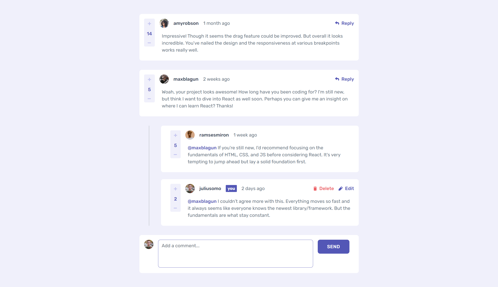

# Frontend Mentor - Interactive comments section solution

This is a solution to the [Interactive comments section challenge on Frontend Mentor](https://www.frontendmentor.io/challenges/interactive-comments-section-iG1RugEG9). Frontend Mentor challenges help you improve your coding skills by building realistic projects.

## Table of contents

- [Overview](#overview)
  - [The challenge](#the-challenge)
  - [Screenshot](#screenshot)
  - [Links](#links)
- [My process](#my-process)
  - [Built with](#built-with)
  - [What I learned](#what-i-learned)
  - [Continued development](#continued-development)

## Overview

### The challenge

Users should be able to:

- View the optimal layout for the app depending on their device's screen size
- See hover states for all interactive elements on the page
- Create, Read, Update, and Delete comments and replies
- Upvote and downvote comments
- **Bonus**: If you're building a purely front-end project, use `localStorage` to save the current state in the browser that persists when the browser is refreshed.
- **Bonus**: Instead of using the `createdAt` strings from the `data.json` file, try using timestamps and dynamically track the time since the comment or reply was posted.

### Screenshot



### Links

- Solution URL: [https://github.com/KH-Ray/interactive-comments-section](https://github.com/KH-Ray/interactive-comments-section)
- Live Site URL: [https://interative-comments-section-be.fly.dev/](https://interative-comments-section-be.fly.dev/)

## My process

### Built with

- Semantic HTML5 markup
- CSS custom properties
- Flexbox
- CSS Grid
- [React](https://reactjs.org/) - JS library
- [TailwindCSS](https://tailwindcss.com/) - Utility-first CSS framework
- [Flowbite React](https://www.flowbite-react.com/) - Component library built on top of Tailwind CSS
- [Express](https://expressjs.com/) - Fast, unopinionated, minimalist web framework for Node.js
- [MongoDB](https://www.mongodb.com/) - A document database with the scalability and flexibility

### What I learned

#### Frontend

```js
const App = () => {
  const queryClient = useQueryClient();

  const currentUserResult = useQuery({
    queryKey: ["currentUser"],
    queryFn: getCurrentUser,
  });

  const commentsResult = useQuery({
    queryKey: ["comments"],
    queryFn: getAllComments,
  });

  const postNewComment = useMutation({
    mutationFn: postComment,
    onSuccess: () => {
      queryClient.invalidateQueries({ queryKey: ["comments"] });
    },
  });

  const deleteExistingComment = useMutation({
    mutationFn: deleteComment,
    onSuccess: () => {
      queryClient.invalidateQueries({ queryKey: ["comments"] });
    },
  });

  const replaceComment = useMutation({
    mutationFn: updateComment,
    onSuccess: () => {
      queryClient.invalidateQueries({ queryKey: ["comments"] });
    },
  });

  if (currentUserResult.isLoading || commentsResult.isLoading) {
    return (
      <main className="flex max-h-full min-h-screen items-center justify-center bg-light-grayish-blue/25">
        <Spinner color="purple" size="xl" />
      </main>
    );
  }

  const currentUser = currentUserResult.data[0];
  const comments = commentsResult.data;

  const addComment = async (event) => {
    event.preventDefault();
    const textInputBox = event.target;
    const commentValue = textInputBox.querySelector("textarea").value;
    textInputBox.querySelector("textarea").value = "";
    postNewComment.mutate({ content: commentValue });
  };

  const removeComment = async (commentId) => {
    deleteExistingComment.mutate(commentId);
  };

  const replaceTextComment = async (comment, commentValue) => {
    replaceComment.mutate({ ...comment, content: commentValue });
  };

  const increaseScoreComment = async (comment) => {
    replaceComment.mutate({ ...comment, score: comment.score + 1 });
  };

  const decreaseScoreComment = async (comment) => {
    replaceComment.mutate({ ...comment, score: comment.score - 1 });
  };

  return (
    <main className="max-h-full min-h-screen bg-light-grayish-blue/25 font-rubik">
      <div className="mx-auto flex max-w-3xl flex-col gap-8 py-4 sm:py-12">
        <div className="flex flex-col gap-8">
          {comments.map((comment) => (
            <CommentBox
              key={comment.id}
              currentUser={currentUser}
              comment={comment}
              handleDelete={removeComment}
              handleIncreaseScore={increaseScoreComment}
              handleDecreaseScore={decreaseScoreComment}
              handleUpdateComment={replaceTextComment}
            />
          ))}
        </div>

        <div>
          <TextInputBox
            currentUser={currentUser}
            buttonText="send"
            handleClick={addComment}
          />
        </div>
      </div>
    </main>
  );
};
```

#### Backend

```js
// currentUser
app.get("/api/currentUser", (request, response) => {
  CurrentUser.find({}).then((user) => {
    response.json(user);
  });
});

// comments
app.get("/api/comments", (request, response) => {
  Comment.find({}).then((comment) => {
    response.json(comment);
  });
});

app.post("/api/comments", async (request, response) => {
  const body = request.body;

  const comment = new Comment({
    content: body.content,
    createdAt: "today",
    score: 0,
    user: {
      image: "https://i.ibb.co/gwDSSft/image-juliusomo.png",
      username: "juliusomo",
    },
    replies: [],
  });

  await comment.save();
  response.status(201).json(comment);
});

app.delete("/api/comments/:id", async (request, response) => {
  await Comment.findByIdAndDelete(request.params.id);
  return response.status(204).end();
});

app.put("/api/comments/:id", (request, response) => {
  const body = request.body;

  const comment = {
    content: body.content,
    createdAt: body.createdAt,
    score: body.score,
    user: body.user,
    replies: body.replies,
  };

  Comment.findByIdAndUpdate(request.params.id, comment, { new: true }).then(
    (updatesComment) => response.status(204).json(updatesComment)
  );
});

// Replies
app.post("/api/comments/:id/replies", (request, response) => {
  const body = request.body;

  Comment.findById(request.params.id).then((comment) => {
    const reply = {
      content: body.content,
      user: {
        image: "https://i.ibb.co/gwDSSft/image-juliusomo.png",
        username: "juliusomo",
      },
      createdAt: "today",
      score: 0,
      replyingTo: comment.user.username,
    };

    comment.replies.push(reply);
    comment.save();
    response.status(201).json(comment);
  });
});

app.delete("/api/comments/:id/replies/:id", (request, response) => {
  const replyingToCommentId = request.url.slice(14, 38);

  Comment.findById(replyingToCommentId).then((comment) => {
    comment.replies = comment.replies.filter((c) => c.id !== request.params.id);
    comment.save();
    response.status(204).end();
  });
});

app.put("/api/comments/:id/replies/:id", (request, response) => {
  const body = request.body;
  const replyingToCommentId = request.url.slice(14, 38);

  Comment.findById(replyingToCommentId).then((comment) => {
    comment.replies = comment.replies.map((c) => {
      const reply = {
        ...c,
        content: body.content ?? c.content,
        createdAt: body.createdAt ?? c.createdAt,
        score: body.score ?? c.score,
        replyingTo: body.replyingTo ?? c.replyingTo,
        user: body.user ?? c.user,
      };

      if (c.id === request.params.id) return reply;

      return c;
    });

    comment.save();
    response.status(204).end();
  });
});
```

### Continued development

There are some small features that I have yet to implement.

## Author

- Frontend Mentor - [@UncertainlySure](https://www.frontendmentor.io/profile/UncertainlySure)
